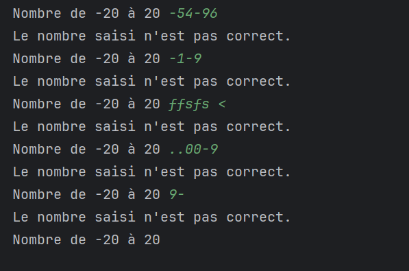
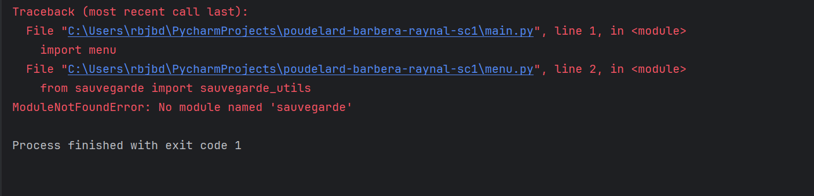

## **1. Présentation Générale :**

# **Projet Poudlard : L'Art de Coder comme un sorcier**

Ce Projet consiste en la création d'un jeu d'aventure interactif en python qui se passe dans l'univers d'Harry Potter.
Le joueur incarne un élève entrant à Poudlard, et va progresser à travers plusieurs chapitres narratifs.

### **Contributeurs**

Raynal Victor

Barbera Ruggero

### **Installation**

Instructions pour cloner le dépôt :

-   Ouvrir GitHub.

-   Copier puis coller :

Victor-Raynal/poudelard-barbera-raynal-sc1 

Dans la barre de recherche et ouvrir le seul résultat trouvé.
    
-   Cliquer sur Code puis copier l’URL HTTPS du dépôt.
    
-   Ouvrir PyCharm.
    
-   Ouvrir le Menu principal (icône représentée par des barres horizontales, en haut à gauche de l'interface)

-   Sélectionner  'Project from version Control'
    
-   Coller l’URL dans le champ URL  et confirmer avec 'Clone'.

Le dépôt est à présent cloné et disponible sur votre machine.

### **Utilisation :**

Pour lancer le jeu, il faut accéder aux différents fichiers du projet en cliquant sur le bouton 'Project' en haut à gauche de l'interface. Ensuite, il faut ouvrir le fichier main.py est le lancer. 
Le jeu vous guidera ensuite à travers l'entièreté du de l'expérience.

À vous de jouer !

### **Fonctionalités principales**

- Création d'un personnage
- Progression narrative par chapitre
- Intéraction du joueur avec les systèmes du jeu (magasin, inventaire, choixpeau magique)
- Système de gestion de données (argent, sorts, maison, objet et sauvegardes)
- Mini-jeux (Quiz sur les sorts et le match de Quidditch)

## **2. Journal de bord**

### **Chronologie du projet**

#### 3 Décembre

-  Commit initial contenant la structure, le chapitre 1 ainsi que les fonctions utilitaires.
-  Ajout d'une partie du chapitre 2

Ce premier jour a vu beaucoup de contenu être ajouté et a permis au dépôt de prendre forme rapidement. Certaines fonctions contenaient certains bugs qui ont été corrigés le lendemain. 
Les fonctions ajoutés étaient testées par les deux contributeurs pour minimiser les oublis. Plusieurs fonctions ont vu plusieurs versions être considérées avant d'être entérinées dans le commit.

#### 4 Décembre 

- Ajout de fonctions utilitaires : menus (une première version), demander_nombre...
- Finalisation du chapitre 2 
- Ajout du début du chapitre 3
- Correction d'erreur concernant une saisie utilisateur

Ce jour s'est passé sans entrave, avec beaucoup de contenu (les chapitres 2 et 3) qui ont été (partiellement) ajoutés.

#### 10 Décembre

- Finalisation du chapitre 3 
- Ajout de la fonction lancer_chapitres dans menus

Ce jour-là, on a pu tester pour la première fois l'intégralité des 3 premiers chapitres grâce aux menus fonctionnels bien que pas terminés. 

#### 11 Décembre

- Toutes les fonctions utilitaires et structurantes entérinées
- Ajout du discours d'introduction
- Correction d'erreur concernant les chemins de fichier
- Correction d'erreur concernant le système de sauvegarde

Certains détails ont d'être ajoutés la structure finale mise en place : le projet était presque prêt pour le dépôt intermédiaire.

#### 20 Décembre 

- Ajout et finalisation du discours de Dumbledore

Le projet était à présent prêt pour le dépôt intermédiaire.

#### 5 Janvier 
 - Ajout et finalisation du chapitre 4 
 - Ajout du fichier README
 - Test du jeu intégral
 - Revue intégrale du code 
 - Correction d'erreur concernant la lecture du chapitre 5 (car inexistant)
 - Correction d'erreur concernant une majuscule dans le nom d'un fichier

Cette phase finale a été consacrée à la finalisation du contenu, aux tests globaux et à la correction de détails, afin de garantir la stabilité et la cohérence du projet.
Elle a été également marquée par des contraintes organisationnelles qui ont impacté la date de rendu.

Nous en assumons pleinement la responsabilité.

Nous avons choisi de s'adapter au mieux à la situation et de se répartir les tâche selon les capacités de chacun ainsi que ses disponibilités.
Ce jour a été certainement marqué par la difficulté la plus importante du projet, mais s'est tout de même conclue par un dépôt final cohérent et complet.

### **Répartition des tâches :**

La répartition des tâches a été pensée de manière équilibrée en termes de volume et de complexité.
Les deux membres du binôme ont été impliqués activement au développement du projet, notamment lors des phases de conception, de tests et de résolution de problèmes.

Une partie du travail a été réalisée en local (tests, reproductions de fonctions, essais de solutions alternatives) afin de débloquer certaines situations. 
Cela dit la pratique s'est heurtée à la théorie et la contrainte de temps que nous avons rencontré ce lundi 5 a forcé quelques changements notamment au niveau de 
la répartition des tâches, résultant en certaines disparités.

## **3. Contrôle, Tests et validations**

### **Gestion des entrées et erreurs :**

Nous avons essayé de minimiser le risque d'erreurs sémantiques. C'est, par exemple, passé par le respect de la cohérence entre ce qu'une variable représente, son nom, son type et son utilisation.
Ou encore, l'introduction de certaines variables intermédiaires. Cela améliore la lecture du code d'une part, et réduit le risque d'erreurs sémantiques d'autre part. 

En termes de débogage, nous avons testé chaque partie du code minutieusement. Pendant l'implémentation, penser aux cas limites a été partie intégrante du processus et a mené à un 
programme sans aucun bug connu (malgré de nombreux tests).
Nombre de fois, nous avons chacun testé les fonctions écrites par chacun, et corrigé toute erreur trouvée. Afin de les corriger, si ce n'était pas trivial, le membre du binôme qui n'a pas écrit la fonction essaye
de l'écrire de son côté, sans consulter celle contenant le bug. Cela permet d'introduire certaines optimisations, et peut-être, surtout, régler le bug en structurant la fonction d'une façon complètement différente.

### **Stratégie de Test :**

Certains cas de tests spécifiques ont notamment été lors du chapitre 1 : 
la fonction demander_nombre qui acceptait des données utilisateurs contenant plusieurs moins('-') 
tester de fond en comble les fonctions nécessitant une entrée utilisateur est essentiel puisque de nombreuses erreurs peuvent provenir d'une saisie 
utilisateur non prévue.
#

La fonction demander_nombre. Heureusement, elle est maintenant corrigée]
#
Des tests globaux sont toutefois nécessaires et ont été faits régulièrement pour vérifier d'une part que la structure fonctionne correctement,
et d'autre part que les différentes parties du jeu soient bien cohérentes entre elles.
#

Ici, un changement empêche le jeu de se lancer correctement, à cause d'une majuscule au nom de dossier 'Sauvegarde'.

